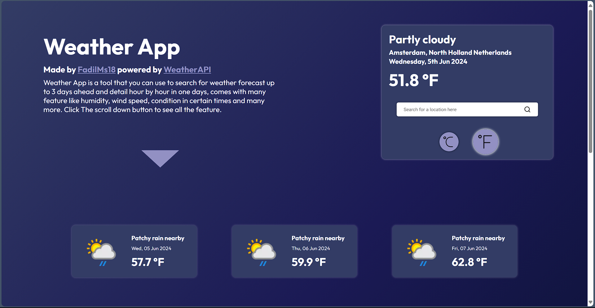
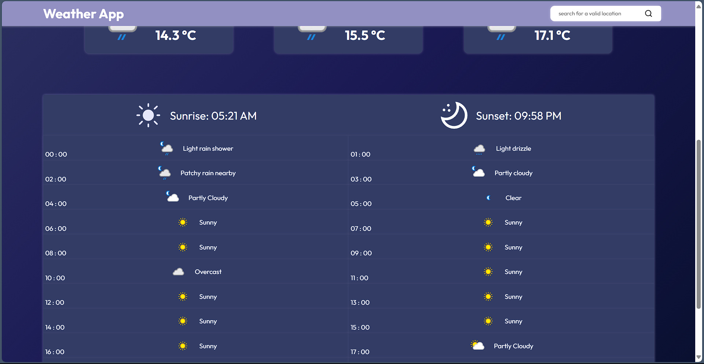
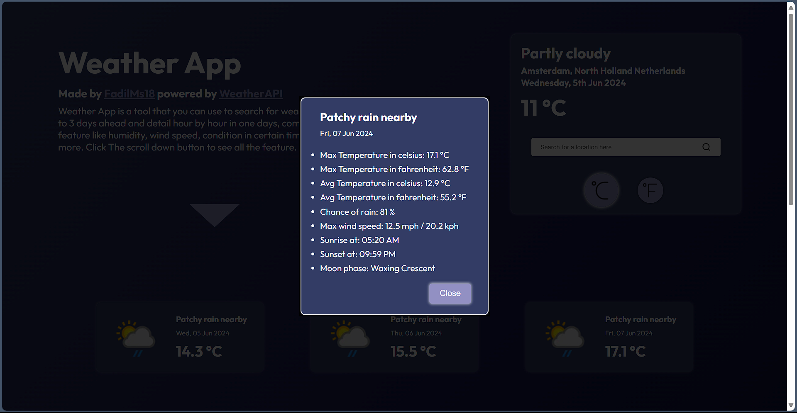

# Weather-App

Live demo you can see here : https://fadilms18.github.io/weather-app/

## Screenshot of the app

## About the App

Weather app is one of the project in The Odin Project(TOP) course that powered by WeatherAPI, user can search for the desired city that they want and the app will proceed to fetch the data form WeatherAPI, user can see detail of the weather up to 3 days and detail for hourly in the current day, user can switch up between °C and °F 

## Built with
1. HTML5
2. CSS3
3. Javascript
4. date-fns library
5. WeatherAPI
6. Prettier for formatter
7. Webpack5